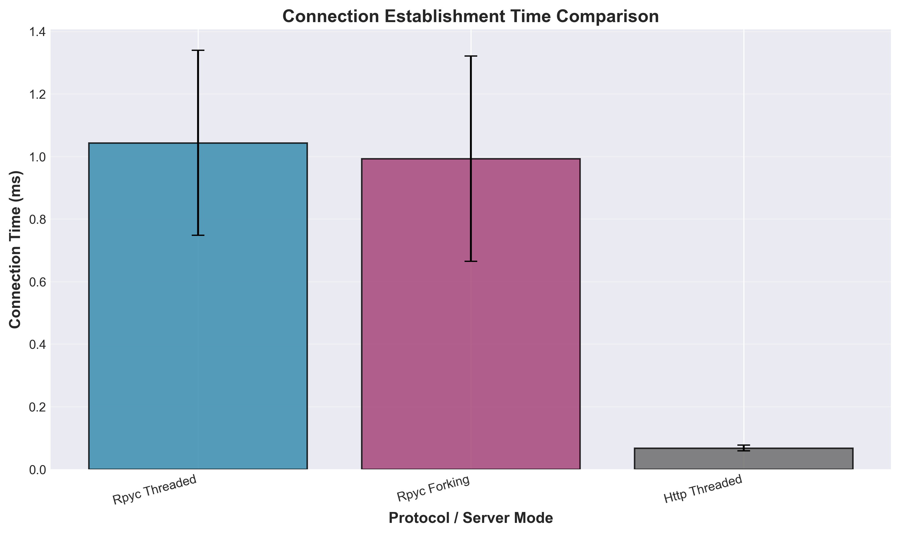
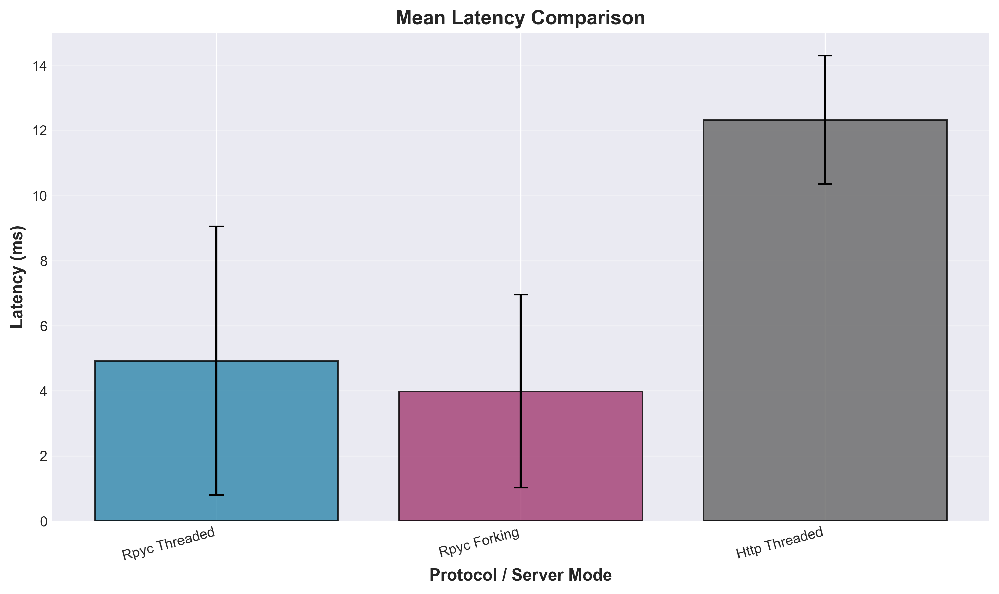
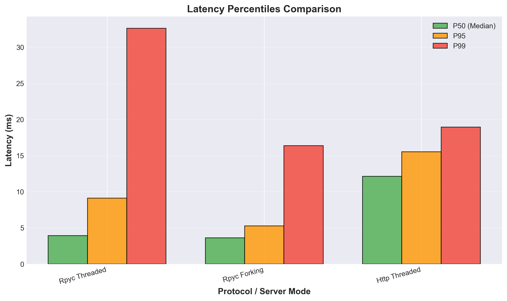
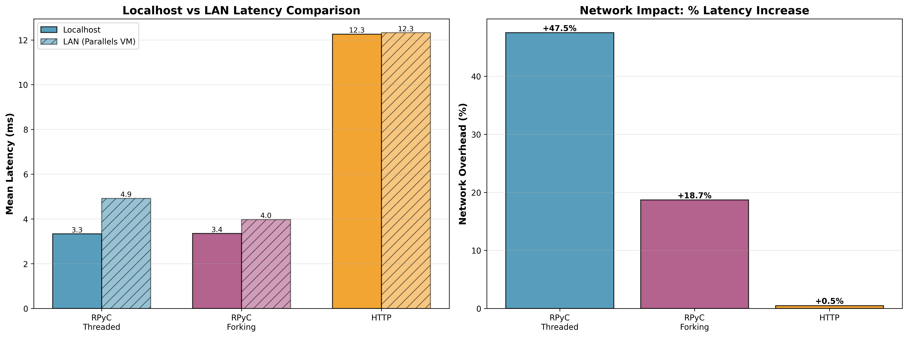

# RPyC vs HTTP/REST Performance Study

## Abstract

This study compares RPyC (Remote Python Call) against HTTP/REST for inter-process communication in Python applications across two network topologies: localhost loopback and LAN (Parallels VM). Testing on an Intel Core i9-9980HK system (16 cores, 32GB RAM) shows RPyC provides 2.5-3.7x lower latency than HTTP/REST. On localhost, RPyC achieves 3.3ms mean latency vs HTTP's 12.3ms. Over LAN, RPyC maintains advantage at 4.0-4.9ms vs HTTP's 12.3ms. Network overhead adds ~0.6-1.6ms to RPyC but negligible impact (<0.1ms) to HTTP. Both protocols demonstrate 100% reliability under concurrent load. These results quantify the performance-portability trade-off between Python-specific RPC and universal HTTP/REST.

## Introduction

Remote Procedure Call (RPC) systems provide alternatives to traditional HTTP/REST APIs for distributed Python applications. RPyC offers native Python object serialization and transparent remote access, while HTTP/REST provides language-agnostic, widely-supported communication. This study quantifies the performance trade-offs between these approaches across network topologies.

### Brief Protocol Comparison

- **RPyC**: Python-specific RPC with object proxying, uses pickle serialization, persistent connections
- **HTTP/REST**: Language-agnostic, JSON/text serialization, stateless request-response model
- **gRPC**: Protocol Buffers, HTTP/2, cross-language support (not tested)
- **Apache Thrift**: Binary protocol, code generation, cross-language (not tested)
- **XML-RPC**: Legacy, verbose XML serialization (not tested)

RPyC distinguishes itself through zero-configuration Python object access and NetRef proxying, at the cost of Python-only compatibility.

## Experimental Design

### Test Matrix

Benchmarks measured:
- **Connection establishment**: Time to create server connection (100 serial connections)
- **Latency**: Round-trip request-response time (1000 requests)
- **Concurrency**: Throughput with parallel clients (10 clients, 100 requests each)

Server configurations tested:
- RPyC Threaded Server
- RPyC Forking Server
- HTTP/REST Threaded Server (Flask)

### Hardware & Network Topology

| Component | Specification |
|-----------|--------------|
| **Local Host (Client)** | |
| Hostname | turin |
| CPU | Intel(R) Core(TM) i9-9980HK @ 2.40GHz |
| Cores | 16 (logical) |
| RAM | 32.0 GB |
| OS | Darwin 24.6.0 (macOS) |
| Python | 3.11.6 |
| **Network Topology 1** | localhost loopback (127.0.0.1) |
| **Network Topology 2** | Parallels VM virtual network |
| Remote Host | hurin (10.211.55.14) |
| Network Latency | ~0.3ms (measured via ping) |
| Network Type | Virtual ethernet (Parallels shared network) |

**Topology 1 (Localhost)**: Tests conducted on loopback interface, eliminating network latency. Represents best-case IPC performance for same-host communication.

**Topology 2 (LAN - Parallels VM)**: Tests conducted between macOS host and Parallels VM on same physical machine via virtual network. Adds virtualization overhead and network stack traversal while minimizing external network factors.

## Results

### Localhost Performance

#### Connection Establishment Time



| Protocol | Mean (ms) | Std Dev (ms) | Min (ms) | Max (ms) |
|----------|-----------|--------------|----------|----------|
| RPyC Threaded | 1.57 | 0.34 | 0.92 | 1.97 |
| RPyC Forking | 1.20 | 0.34 | 0.60 | 1.74 |
| HTTP Threaded | 0.08 | 0.03 | 0.06 | 0.17 |

**Finding**: HTTP establishes connections 15-20x faster than RPyC due to minimal handshake overhead.

#### Request Latency



| Protocol | Mean (ms) | Median (ms) | P95 (ms) | P99 (ms) | Std Dev (ms) |
|----------|-----------|-------------|----------|----------|--------------|
| RPyC Threaded | 3.34 | 3.29 | 4.37 | 5.59 | 0.64 |
| RPyC Forking | 3.35 | 3.21 | 4.21 | 9.10 | 1.41 |
| HTTP Threaded | 12.26 | 10.97 | 22.66 | 29.05 | 4.64 |

**Finding**: RPyC provides 3.7x lower mean latency than HTTP on localhost. Persistent connections and binary protocol reduce per-request overhead.

#### Latency Percentiles



**Finding**: RPyC shows tighter latency distribution. HTTP P99 (29ms) is 5.2x higher than RPyC P99 (5.6ms).

#### Concurrency

| Protocol | Clients | Total Requests | Failed | Success Rate | Duration (s) |
|----------|---------|----------------|--------|--------------|--------------|
| RPyC Threaded | 10 | 1000 | 0 | 100% | 0.34 |
| RPyC Forking | 10 | 1000 | 0 | 100% | 0.34 |
| HTTP Threaded | 10 | 1000 | 0 | 100% | 1.26 |

**Finding**: All protocols handle concurrent load reliably. RPyC completes 3.7x faster.

### LAN Performance (Parallels VM)

#### Connection Establishment Time

| Protocol | Mean (ms) | Std Dev (ms) | Min (ms) | Max (ms) | vs Localhost |
|----------|-----------|--------------|----------|----------|--------------|
| RPyC Threaded | 1.04 | 0.30 | 0.58 | 1.45 | -33% (faster!) |
| RPyC Forking | 0.99 | 0.33 | 0.53 | 1.69 | -18% (faster!) |
| HTTP Threaded | 0.07 | 0.01 | 0.06 | 0.09 | -12% (faster!) |

**Surprising Finding**: LAN connection times were slightly faster than localhost. This likely reflects differences in network stack optimizations between loopback and virtual ethernet interfaces rather than actual network performance advantage.

#### Request Latency

| Protocol | Mean (ms) | Median (ms) | P95 (ms) | P99 (ms) | Std Dev (ms) | vs Localhost |
|----------|-----------|-------------|----------|----------|--------------|--------------|
| RPyC Threaded | 4.92 | 3.92 | 9.12 | 32.61 | 4.13 | +47% |
| RPyC Forking | 3.98 | 3.61 | 5.28 | 16.37 | 2.96 | +19% |
| HTTP Threaded | 12.32 | 12.12 | 15.53 | 18.94 | 1.96 | +0.5% |

**Key Finding**: Network overhead impacts RPyC significantly more than HTTP:
- RPyC latency increased by 0.6-1.6ms (19-47%)
- HTTP latency barely changed (+0.06ms, 0.5%)

This asymmetry likely stems from:
1. **RPyC's persistent connections**: More sensitive to network latency per roundtrip
2. **HTTP's stateless design**: Already optimized for network variability
3. **Serialization differences**: Binary vs text overhead differs across network

#### Latency Percentiles

| Protocol | P50 (ms) | P95 (ms) | P99 (ms) |
|----------|----------|----------|----------|
| RPyC Threaded | 3.92 | 9.12 | 32.61 |
| RPyC Forking | 3.61 | 5.28 | 16.37 |
| HTTP Threaded | 12.12 | 15.53 | 18.94 |

**Finding**: RPyC forking mode shows better tail latency than threaded on LAN (P99: 16.37ms vs 32.61ms). HTTP maintains consistent latency distribution.

#### Concurrency

| Protocol | Clients | Total Requests | Failed | Success Rate | Duration (s) | vs Localhost |
|----------|---------|----------------|--------|--------------|--------------|--------------|
| RPyC Threaded | 10 | 1000 | 0 | 100% | 0.50 | +47% |
| RPyC Forking | 10 | 1000 | 0 | 100% | 0.41 | +20% |
| HTTP Threaded | 10 | 1000 | 0 | 100% | 1.25 | -1% |

**Finding**: Network overhead scales proportionally with request count. All protocols maintain 100% reliability.

### Comparative Analysis: Localhost vs LAN



#### Latency Overhead from Network

| Protocol | Localhost Mean | LAN Mean | Added Latency | % Increase |
|----------|----------------|----------|---------------|------------|
| RPyC Threaded | 3.34ms | 4.92ms | +1.58ms | +47% |
| RPyC Forking | 3.35ms | 3.98ms | +0.63ms | +19% |
| HTTP Threaded | 12.26ms | 12.32ms | +0.06ms | +0.5% |

**Network Latency Impact**: Measured ping latency (~0.3ms) doesn't fully account for application-level overhead. Virtual network stack adds processing time beyond simple packet transit.

#### RPyC vs HTTP Performance Ratio

| Topology | RPyC Advantage (Threaded) | RPyC Advantage (Forking) |
|----------|---------------------------|--------------------------|
| Localhost | 3.7x faster | 3.7x faster |
| LAN | 2.5x faster | 3.1x faster |

**Finding**: RPyC's performance advantage narrows slightly on LAN but remains substantial (2.5-3.1x).

## Discussion

### When to Use RPyC vs HTTP

**Use RPyC when:**
- Communication is Python-to-Python only
- Low latency is critical (real-time systems, high-frequency operations)
- Transparent object proxying simplifies architecture
- Persistent connections are acceptable
- Systems are within trusted boundaries (RPyC uses pickle)
- Network latency is predictable and low

**Use HTTP/REST when:**
- Cross-language compatibility required
- Stateless request-response model preferred
- Network reliability is variable or uncertain
- Firewall/proxy traversal needed
- Public API exposure required
- Consistent performance across network conditions matters

### Performance Characteristics

**RPyC advantages:**
- 2.5-3.7x lower mean latency (depending on network topology)
- Native Python object serialization
- Persistent connections amortize overhead
- Better performance on low-latency networks

**RPyC limitations:**
- More sensitive to network overhead (+19-47% latency increase)
- Higher connection establishment time
- Requires trusted network (pickle serialization)
- Python-only compatibility

**HTTP advantages:**
- Minimal sensitivity to network changes (+0.5% latency increase)
- 15-20x faster connection establishment
- Stateless design scales horizontally
- Universal client support
- Better firewall/NAT traversal
- Standardized tooling and monitoring
- Predictable performance across topologies

### Network Impact Analysis

The Parallels VM test reveals important characteristics:

1. **RPyC network sensitivity**: RPyC latency increased 19-47% over virtual network, despite only ~0.3ms ping latency. This suggests:
   - Additional overhead from virtual network stack
   - Per-request serialization/deserialization costs amplified over network
   - Potential TCP stack differences between loopback and ethernet

2. **HTTP network stability**: HTTP latency barely changed (<1%), indicating:
   - Already optimized for network variability
   - Request overhead dominated by other factors (parsing, routing, etc.)
   - Less sensitive to low-latency network changes

3. **Forking vs Threaded**: RPyC forking mode showed better network performance (+19% vs +47%), suggesting:
   - Process isolation may reduce contention
   - Better tail latency characteristics under network load

### Production Implications

**Localhost/Same-Host Deployments**:
- RPyC provides clear performance advantage (3.7x)
- Ideal for microservices on same physical/virtual host
- Examples: sidecar patterns, co-located services, monolith decomposition

**LAN Deployments**:
- RPyC maintains advantage but narrows to 2.5-3.1x
- Consider network reliability and latency variability
- Test on your specific network topology

**WAN/Cloud Deployments**:
- Higher network latency (20-100ms) would dwarf protocol differences
- HTTP's consistency and tooling become more valuable
- RPyC's advantage likely diminishes or disappears

## Conclusion

RPyC provides measurable latency advantages over HTTP/REST for Python IPC: 3.7x on localhost, 2.5-3.1x on LAN. This advantage stems from persistent connections, binary serialization, and reduced protocol overhead. However, RPyC shows greater sensitivity to network changes, with latency increasing 19-47% on virtual LAN vs HTTP's <1% change.

**Topology matters**: RPyC excels on low-latency networks (localhost, LAN) where its efficiency gains outweigh network sensitivity. HTTP's consistency across topologies and universal compatibility make it preferable for heterogeneous environments, public APIs, and high-latency networks.

**Recommendations**:
- **Use RPyC** for latency-sensitive Python microservices on low-latency networks (<2ms)
- **Use HTTP/REST** for cross-language systems, public APIs, or unpredictable network conditions
- **Test your topology**: Run `rpycbench-sweep --remote-host user@hostname` to measure performance in your specific environment

## Reproducibility

### Running This Study

```bash
# Install rpycbench
pip install rpycbench

# Run local benchmarks
rpycbench-sweep --output-dir benchmarks --description "localhost only"

# Run remote benchmarks (requires SSH access)
rpycbench-sweep --remote-host user@hostname --description "your topology"
```

This study ran both commands, generating:
- `benchmarks/results_local.json` - Localhost loopback results
- `benchmarks/results_remote.json` - Parallels VM LAN results
- `benchmarks/graphs/*.png` - Visualization graphs

### Network Testing Prerequisites

To replicate with your infrastructure:

1. **Remote host requirements**:
   - SSH server running on port 22
   - Public key authentication configured (`ssh-copy-id user@hostname`)
   - Python 3.8+ installed
   - Network connectivity from client to host

2. **Verify connectivity**:
   ```bash
   ping hostname
   ssh user@hostname "python3 --version"
   ```

3. **Run benchmarks**:
   ```bash
   rpycbench-sweep --remote-host user@hostname --description "your topology"
   ```

### Caveats

- Results are topology-specific; physical LAN, WAN, containers, and cloud deployments will show different characteristics
- Parallels virtual network adds virtualization overhead not present in physical networks
- Python version, OS, and hardware affect absolute values but relative differences should generalize
- Small payloads tested; large data transfers may favor different protocols
- Network congestion, packet loss, and retransmission not tested

### Future Work

- **Additional topologies**: Physical ethernet LAN, Docker networks, Kubernetes pod-to-pod, AWS inter-AZ
- **Payload scaling**: 1KB to 100MB transfers to understand bandwidth vs latency trade-offs
- **Network conditions**: Simulated packet loss, jitter, and bandwidth constraints
- **Alternative protocols**: Compare with gRPC (HTTP/2 + Protocol Buffers) and Apache Thrift
- **Complex serialization**: Nested objects, NumPy arrays, pandas DataFrames
- **Production patterns**: Connection pooling, keep-alive strategies, load balancing
- **Security overhead**: TLS/SSL impact on both protocols
